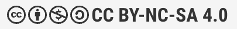

# pft-eprimer-agentic-github-copilot-demo

This project holds an updated sample project of artifacts of contemporary exploratory testing. There are few things that this illustrates:

- Session-based notetaking and use of Github Copilot Agent mode in reporting and test idea generation
- Documenting with test automation and use of Github Copilot agent mode in creating python-playwright test automation while exploring

This repository with examples is made available with Creative Commons Attribution Non-Commercial Sharealike https://creativecommons.org/licenses/by-nc-sa/4.0/ and for more permissive licenses, contact CGI Suomi Oy / Maaret Pyhäjärvi.
